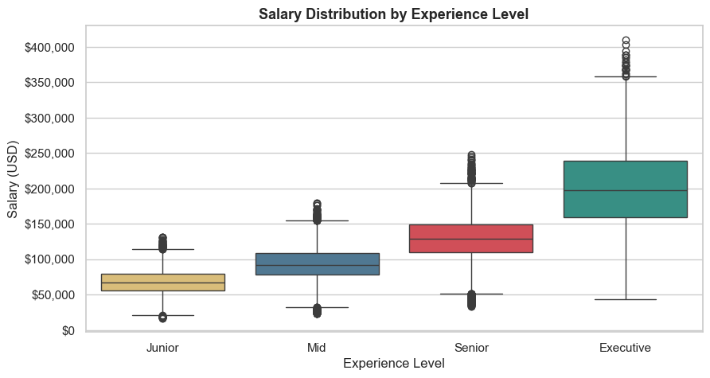
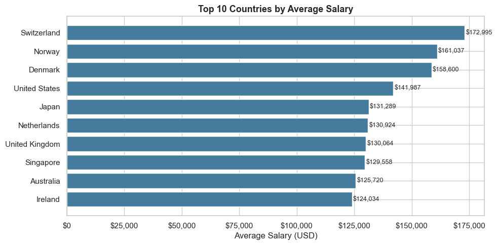
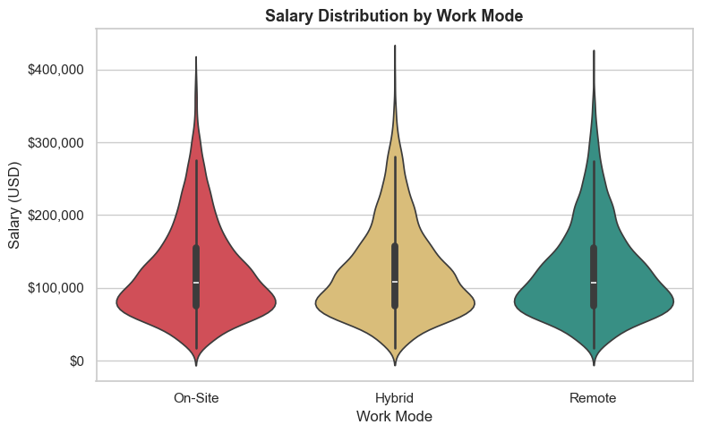
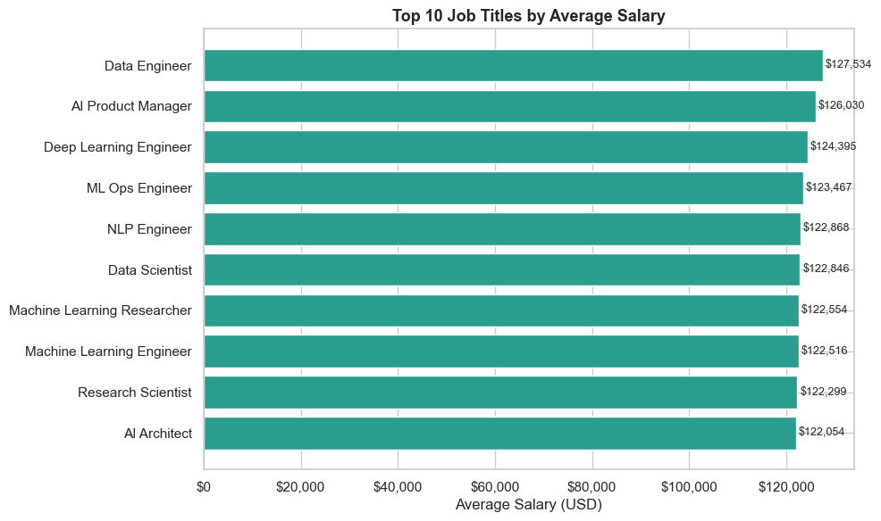
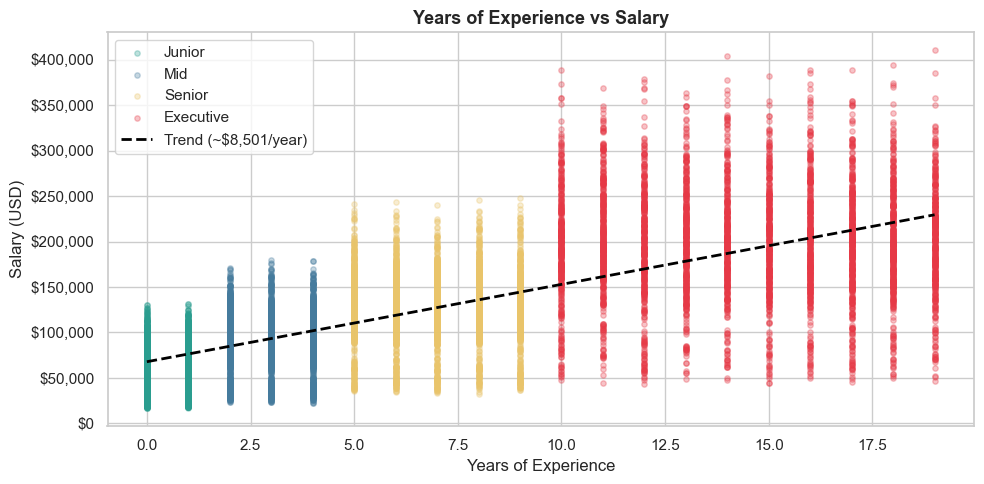
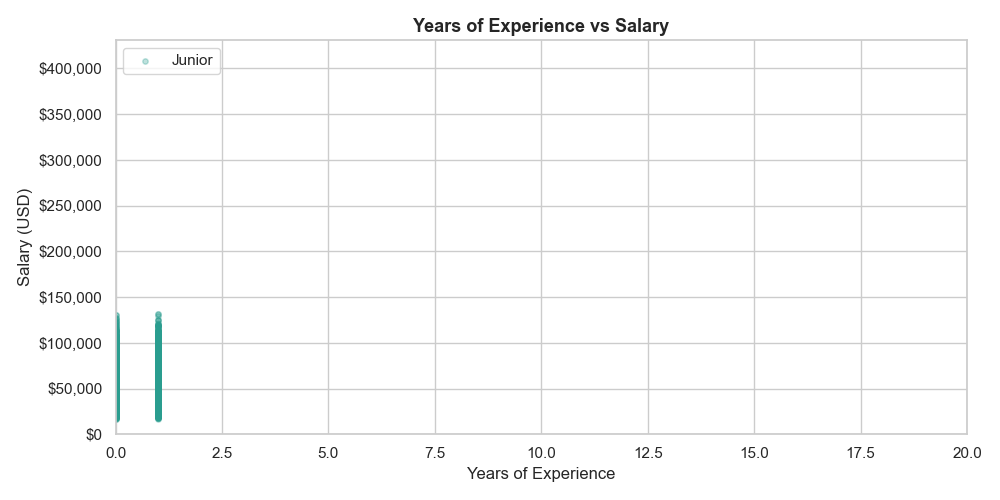
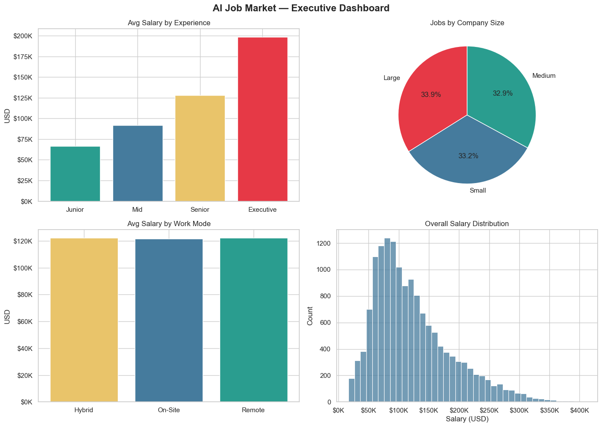
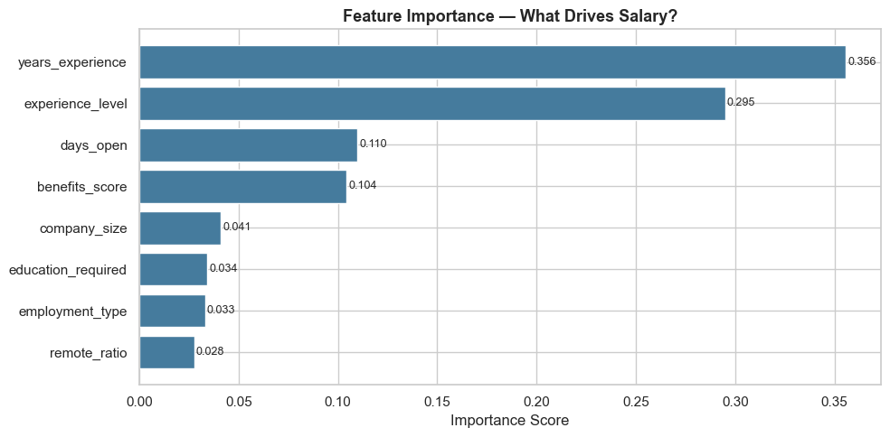
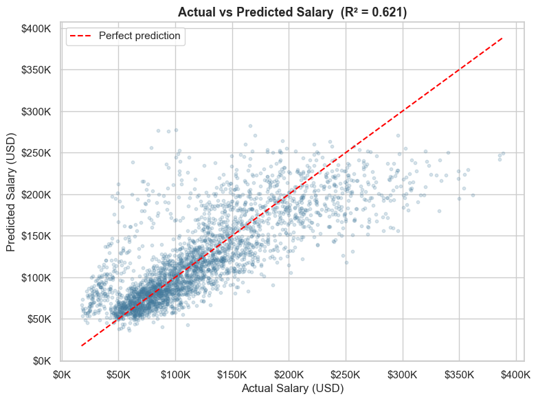

<div align="center">
  
</div>

# 💼 AI Jobs Market Analysis & Salary Prediction

### Data-Driven Insights into AI-Related Roles, Salaries and Hiring Trends

[](https://python.org)
[](https://scikit-learn.org)
[](https://sqlite.org)
[]()
[]()

---

## 📌 Project Overview

An end-to-end analysis of the global AI job market: salary trends, experience levels, remote work, industries, and a machine learning model that predicts salaries from job attributes. The project covers the full analytical pipeline — data cleaning, SQL analysis, visualization, machine learning, and an interactive Power BI dashboard.

The codebase is organized as **modular Python scripts** (not a single notebook), each handling one stage of the pipeline — a structure closer to how analysis is run in production.

---

## 🗂 Dataset

- **Source:** [Global AI Job Market & Salary Trends 2025 — Kaggle](https://www.kaggle.com/datasets/bismasajjad/global-ai-job-market-and-salary-trends-2025)
- **Size:** 15,000 job records, 20+ columns
- **Nature:** Synthetic dataset (generated to resemble real AI job market patterns)
- **Coverage:** Multiple countries, industries, experience levels, and work modes

> Note: this is a synthetic dataset. It is well-suited for demonstrating the full analytical workflow, while some relationships are less noisy than real-world data would be.

---

## 🗂 Project Structure

```
AI_Labor_Market_Impact_Analysis/
│
├── analysis/
│   ├── cleaning_eda.py        # data loading, cleaning, feature engineering, EDA
│   ├── visualization.py       # 6 charts + 1 animated GIF
│   ├── sql_analysis.py        # 6 SQL queries via in-memory SQLite
│   └── ml_model.py            # Random Forest salary prediction + feature importance
│
├── data/
│   ├── ai_job_dataset1.csv    # raw dataset (15,000 records)
│   └── processed/
│       └── ai_jobs_clean.csv  # cleaned dataset (script output)
│
├── output/                    # charts, GIF, model results, Power BI CSVs
├── assets/
└── README.md
```

---

## ⚙️ How to Run

```bash
pip install pandas numpy matplotlib seaborn scikit-learn

# run in order:
python analysis/cleaning_eda.py      # produces the cleaned dataset
python analysis/visualization.py     # generates charts + GIF
python analysis/sql_analysis.py      # runs SQL queries
python analysis/ml_model.py          # trains model, exports results
```

---

## 🔄 Workflow

### 1. Data Cleaning & EDA (`cleaning_eda.py`)
- Standardized categorical codes into readable labels (EN/MI/SE/EX → Junior/Mid/Senior/Executive; work mode; company size; employment type)
- Converted date columns and derived `days_open` (posting open duration)
- Created `salary_bracket` with `pd.cut`
- Exploratory analysis: salary by experience, country, work mode, industry, company size; correlation with salary

### 2. Visualization (`visualization.py`)
- 6 charts: salary distribution by experience (boxplot), top countries (bar), salary by work mode (violin), top job titles, experience-vs-salary scatter with trend line, and a 2×2 executive dashboard
- 1 animated GIF: experience levels appearing progressively

### 3. SQL Analysis (`sql_analysis.py`)
- 6 queries on an in-memory SQLite database
- Techniques: `GROUP BY`, `HAVING`, multi-column grouping, subqueries, `IN`, aggregates
- Examples: average salary by experience, top countries, remote distribution, top job titles (min 50 postings), salary by experience × company size, senior/executive roles above market average

### 4. Machine Learning (`ml_model.py`)
- **Random Forest Regressor** predicting `salary_usd`
- Label Encoding for categorical features, 80/20 train/test split
- Feature importance analysis
- Exports: feature importance, model results, and actual-vs-predicted for Power BI

---

📈 Visualizations

All charts are generated by the analysis scripts and saved to the `output/` folder.

### Salary by Experience Level


A boxplot showing how salary is distributed across the four experience levels. Salary rises clearly and consistently from Junior to Executive, and the spread widens at senior levels — higher roles offer both higher pay and more variation.

### Top 10 Countries by Average Salary


The countries offering the highest average AI salaries. There is strong geographic variation, with Switzerland and the United States leading the ranking.

### Salary by Work Mode


A violin plot comparing On-Site, Hybrid, and Remote roles. The three distributions are almost identical — an early signal that remote work has little impact on salary, later confirmed by the model.

### Top 10 Job Titles by Average Salary


The highest-paying AI job titles on average, highlighting which specific roles command a premium in the market.

### Years of Experience vs Salary


A scatter plot of every job, colored by experience level, with a linear trend line. The slope quantifies roughly how much salary grows per additional year of experience.



The same relationship animated — experience levels appear progressively, making the salary-experience progression easy to follow.

### Executive Dashboard (summary)


A 2×2 snapshot of the market: average salary by experience, jobs by company size, average salary by work mode, and the overall salary distribution — a one-glance overview.

### Feature Importance — What Drives Salary?


The model's ranking of which features matter most for predicting salary. Years of experience (≈36%) and seniority (≈29%) dominate, together accounting for about two-thirds of the predictive power. Remote ratio is the weakest at 2.8%.

### Actual vs Predicted Salary


Each point is a job from the held-out test set: the x-axis is the real salary, the y-axis the predicted one. Points cluster around the diagonal (perfect-prediction line), showing the model captures the trend, while the vertical spread reflects the model's R² of 0.62 and its average error.

---

## 🤖 Machine Learning Results

**Objective:** predict salary from experience, education, location-independent job attributes, and work mode.

**Model:** Random Forest Regressor (100 trees)

| Metric | Value | Meaning |
|--------|-------|---------|
| **R²** | **0.62** | Explains ~62% of salary variance |
| **MAE** | **$27,066** | Average absolute error |
| **RMSE** | **$38,954** | Error penalizing large misses |

The model captures the overall salary trend. The error is meaningful in absolute terms — partly reflecting the synthetic nature of the data — so it is best read as a directional estimator, not a precise salary calculator.

### Feature Importance — What Drives Salary?

| Rank | Feature | Importance |
|------|---------|-----------|
| 1 | Years of experience | 35.6% |
| 2 | Experience level (seniority) | 29.5% |
| 3 | Days open | 11.0% |
| 4 | Benefits score | 10.4% |
| 5 | Company size | 4.1% |
| 6 | Education required | 3.4% |
| 7 | Employment type | 3.3% |
| 8 | Remote ratio | 2.8% |

---

**Key insight:** experience-related factors (years + seniority) together account for ~65% of the model's predictive power. Education, employment type, and remote ratio have surprisingly low impact — in this dataset, **experience drives salary far more than credentials or work mode**.

---

## 📊 Power BI Dashboard
The interactive dashboard allows you to explore these results dynamically:

**Interactive Dashboard:**
[](https://app.powerbi.com/view?r=eyJrIjoiYmIzZDJlMDUtODk0NS00ZTMxLWE4MWItOWNhNTQzYjJkZTQzIiwidCI6IjFmNTRhMThlLTg0MjUtNDdiYi1hMDk3LTczODg2ZTM1MTE4YSIsImMiOjh9&pageName=913f4d965e67386d88d3)
<sup>↗️ *Ctrl+click to open in a new tab*</sup>

---

## 🛠 Tech Stack

| Area | Tools |
|------|-------|
| **Language** | Python (modular scripts) |
| **Data & Analysis** | Pandas, NumPy |
| **SQL** | SQLite (in-memory queries) |
| **Visualization** | Matplotlib, Seaborn, FuncAnimation |
| **Machine Learning** | scikit-learn — Random Forest Regressor, Label Encoding |
| **BI & Reporting** | Power BI |

---

## 🔑 Key Findings

- Salary rises strongly and consistently with experience level
- Years of experience + seniority explain ~65% of salary prediction power
- Remote work has minimal impact on salary in this dataset (2.8% importance)
- Education level is a weaker salary driver than commonly assumed
- Executive roles earn roughly 3× junior roles on average

---

## 🚀 Possible Improvements

- Hyperparameter tuning and cross-validation to improve R²
- Test additional models (Gradient Boosting) for comparison
- Validate findings on a real (non-synthetic) dataset
- Add geographic salary normalization (cost of living)

---

## 👤 Author

**Gabriele De Carlo** · Python · SQL · Power BI — Data Analyst Portfolio Project, 2025


